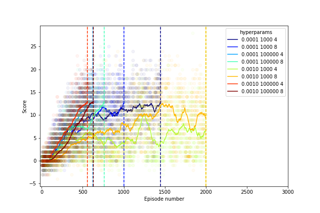

# Project 1: Navigation

## Introduction

This project consists of a Unity environment that is a large square that has both blue and yellow bananas. Whenever a yellow banana is collected a reward of +1 is given to the agent, and if a blue banana is collected then a reward of -1 is given to the agent. Thus, to maximize the total reward given to the agent, more yellow bananas need to be collected than blue bananas.  There are 37 dimensions in the state space and it contains the agent's velocity, along with ray-based perception of objects around agent's forward direction.  The agent has 4 possible actions:

- `0` - walk forward 
- `1` - walk backward
- `2` - turn left
- `3` - turn right

This is episodic, and to consider this environment solved, an average score of +13 over 100 episodes needs to be obtained.

## Learning algorithm 

The learning algorithm used in the project is a Double Deep Q-Network (DDQN) with an experience replay buffer. This is the same framework that was used in the solutions to the Lunar Lander lesson in this nanodegree, and the code is adapted from those solutions.  The DDQN framework is an extension of DQN which utilizes two Q-networks: a local network and a target network.  The intent behind using two networks is to decouple the action selection and action evaluation.  This is done to address the known issue that traditional DQN tends to have an overestimatation bias in Q-value estimates.  The local network is updated at every step, whereas the target network is only periodically updated.  The hyperparameter update_every defines the number of time steps between when the target network is soft updated by taking on a weighted combination of the local and target network.  In this case the hyperparameter τ determines the weighting between target and local network parameters θ, θ_target = τ*θ_local + (1 - τ)*θ_target.  

An experience replay buffer is also used.  This buffer is a fixed size (hyperparameter N) set of experiences (state, action, reward, next state, done).  After a number of these experiences are accumulated, they can be sampled.  Using this type of sampling, correlations between time steps in reduced, and experiences can be used more than once.

## Results

In the main notebook Navigation.ipynb, a small grid search of 8 hyperparameters is performed.  Only if the set of hypereparameters yielded a solution was the model saved.  The set of hyperparameters that were used are:

  | Hyperparameter                      | Value |
  | ----------------------------------- | ----- |
  | buffer_size                  | 1e5, 1e3   |
  | lr (learning rate)                  | 1e-3, 1e-4  |
  | update_every                        | 4, 8     |
  | batch_size                          | 64    |
  | gamma                               | 0.9   |
  | tau                                 | 1e-3  |
  | n_episodes                          | 2000   |
  | max_t                               | 1000  |
  | eps_start                       | 1.0   |
  | eps_end                     | 0.01   |
  | eps_decay                       | 0.995 |

The resulting scores for each combination of hyperparameters is shown here (labeled by their lr, buffer_size, and update_every parameters) 

As can be seen, some combinations of hyperparameters were able to solve the environment in fewer episodes than others.  The episode where the agent solved the environment is indicated with a vertical dashed line.  The corresponding hyperparameters and stopping episodes are

 | lr buffer_size update_every | Stopping episode |
 | --------------------------- | ---------------- |
 |'0.0010 100000 4'| 561 |
 |'0.0001 100000 4'| 623 |
 |'0.0010 100000 8'| 630 |
 |'0.0001 100000 8'| 763 |
 |'0.0001 1000 8'| 1004 |
 |'0.0001 1000 4'| 1451 |
 |'0.0010 1000 4'| 2000 |
 |'0.0010 1000 8'| 2000 |

As can be seen, a larger replay buffer size was advantageous to solving the environment quickly.  

## Future work

One method that could be implemented to improve performance is a prioritized replay buffer.  This prioritizes the experiences in the replay buffer to be sampled.  This is explained in this [paper](https://arxiv.org/abs/1511.05952).

Another way to improve performance would be to use a [dueling DQN](https://arxiv.org/abs/1511.06581).

Finally, using the actual pixel values would be a fun way to try and improve performance.